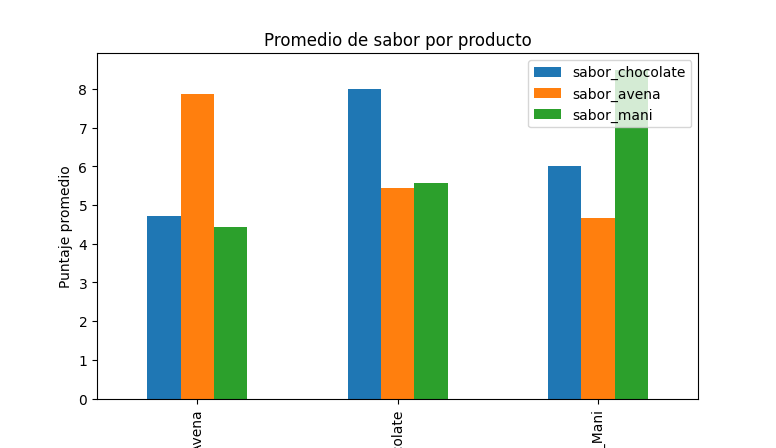
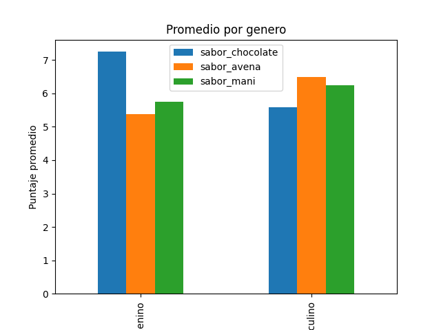

## Analisis encuestas Ficticia
    

## 📌 Descripción
Este proyecto consiste en el análisis de una encuesta ficticia con el objetivo de calcular promedios y obtener conclusiones básicas a partir de los datos.

## 🎯 Objetivo
- Simular un conjunto de datos de encuestas en formato CSV, representando información de estudios de mercado. 
- Calcular promedios de variables numéricas
- Explorar los resultados de la encuesta de forma clara
- Practicar el uso de herramientas de análisis de datos

## 🧰 Herramientas
- Python
- Excel
- Pandas
- Matplotlib

##  Analisis Realizado
- Exploración de datos
- Análisis de familiaridad
- Promedios de sabor
- Preferencia del consumidor
- Visualización de resultados

## 📊 Resultados

## 📂 Estructura del proyecto
- data/: datos de la encuesta
- notebooks/: análisis exploratorio
- scripts/: scripts en Python